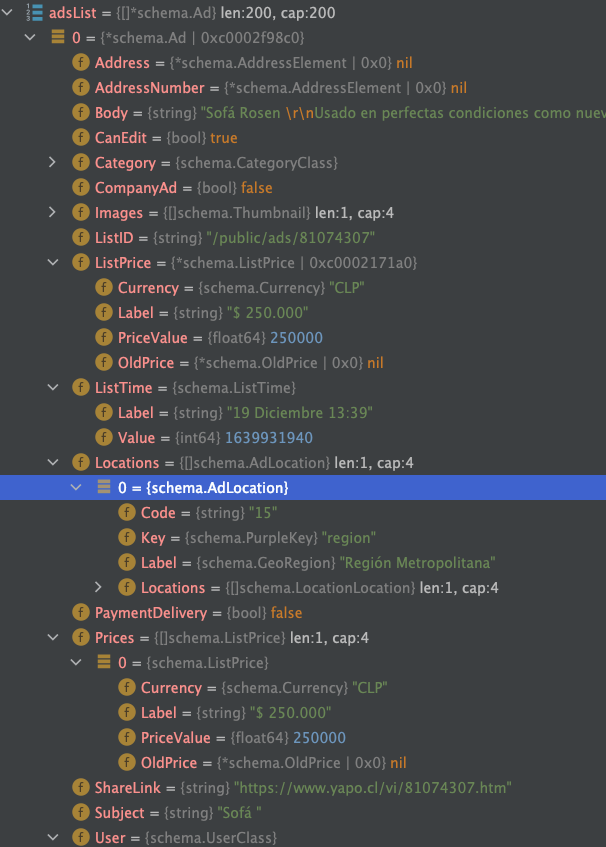
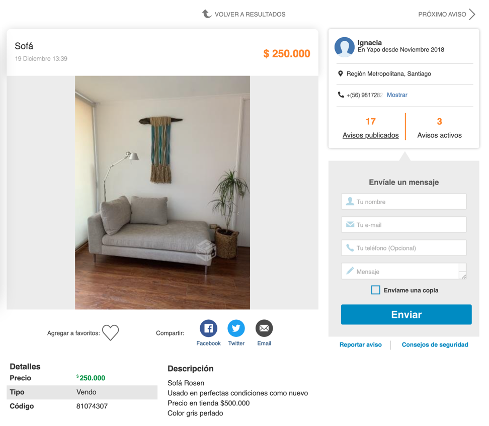
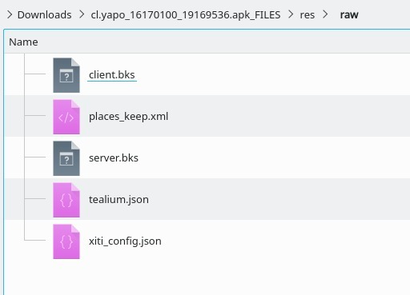
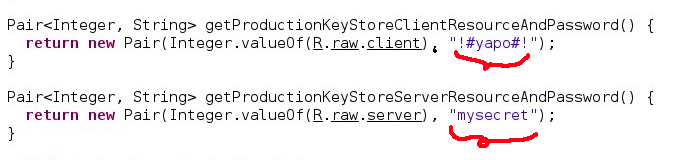

## Yapo.cl Mobile Api Client

This library allows querying the [Yapo.cl](https://www.yapo.cl) API.

It has been obtained by reverse engineering from the mobile app

It is done as a practice from my Pentester course.

### Usage

```go
c := client.NewClient(client.Options{})
opts := client.ListAdsOptions{}
adsList, nextPageId, err := c.ListAds(opts)
```

It will display a list of announcements.



The first item on this list refers to the following ad:



### List of endpoints found

The API host is: https://apps.yapo.cl.
<br>
Example: To get the ads list, use the following url:
<br>
https://apps.yapo.cl/api/v1.2/public/ads?l
<br>
This is the list of endpoints in the api.
<br>
<br>
Only endpoints to search for categories and publications (ads) are supported by this go api client.


- /public/categories/filter (Supported by this client)
- /public/ads (Supported by this client)
- /public/regions
- /public/categories/insert
- /public/filters
- /public/ads/{ad_id}
- /public/regions?from={from}
- /public/location/zipcode?zipcode={zip_code}
- /public/location
- /public/filters/database
- /public/ads/{ad_id}/events
- /public/delete_reasons
- /private/accounts
- /private/accounts
- /private/accounts/{account_id}
- /private/accounts/{account_id}
- /private/accounts/{account_id}/ads
- /private/accounts/{account_id}/ads/{ad_id}/actions
- /private/accounts/{account_id}/ads/{ad_id}
- /private/accounts/{account_id}/ads
- /public/media/ad
- /public/media/account
- /public/ads/{ad_id}/phone
- /public/ads/{list_id}/messages
- /private/accounts/otp
- /public/ads/{list_id}/abuse
- /private/accounts/{account_id}/ads/reactivate/{ad_id}
- /private/accounts/{account_id}/purchase

### Process of reverse app engineering

1. Download the yapo [Apk](https://m.apkpure.com/es/yapo-cl-compra-y-vende-cerca-de-ti/cl.yapo)

2. Use burp suite to find the API calls
    - It was observed that the app uses client certificate verification
    - We will need to search within the apk


3. Try to find the certificates in the unzipped apk.
    - The certificates are stored in the `/res/raw` folder
    - 

4. It is observed that the certificates are stored in a keystore "Bouncy Castle" (.bks)

5. We proceed to find the password of said keystore in the app code:

Decompile the apk (use Dex2jar and procyon)

```shell
# First we need to convert dex to jar (.apk -> .jar)
sh ./d2j-dex2jar.sh -f yapo.apk

# Then we need to decompile the jar (.jar -> *.java)
java -jar procyon-decompiler-0.6-prerelease.jar -jar yapo-dex2jar.jar -o yapo_src
```

    - The keystore password is hardcoded in the app code:
        - For the client bks is: "!#yapo#!"
        - For the server bks is: "mysecret"

- 

7. Extract the client and key certificate and removing the password

- It produces the following files:
    - certs/client.cert.pem (for client.bks)
    - certs/client.key.pem (for client.bks)
    - certs/server.cert.pem (for server.bks)

Notes:

- This repository is for purely academic and practice purposes.
- There is no relationship with the authors of the api and app.
- The yapo team has been informed about this "vulnerability"

